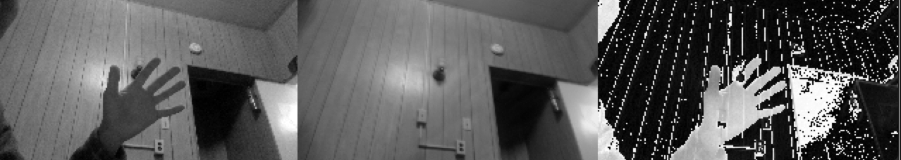

# RandomizedSVD

Implementation of Fast Randomized SVD [1] for low-rank approximation of matrices using C++/Eigen.

Also:

* Demo of background removal in webcam feed using randomized SVD
* Implementation of robust PCA [4]



### Requirements

* Eigen (currently assumed to be in _eigen_ folder in root)
* OpenCV (for background removal demo)

### Building

```
cd [eigen from somewhere else] .
mkdir build
cd build
cmake ..
make
```

### Using

Implementation of randomized SVD is in `randomized_svd.h`, robust PCA in `robust_pca.h`. For the randomized SVD, the interface is the same as [Eigen's SVD](https://eigen.tuxfamily.org/dox/group__SVD__Module.html).

* `TryRandomizedSvd`: Apply randomized SVD to large matrix to demonstrate speed advantages, reconstruction error (spectral norm).
* `BackgroundRemoval`: Use rSVD to separate (dynamic) foreground from (static) background in webcam feed.
* `TryRobustPca`: Apply robust PCA (separating matrix into low-rank and sparse components) on small matrix

### References

1. Nathan Halko, Per-Gunnar Martinsson, and Joel Tropp, _Finding structure with randomness: probabilistic algorithms for constructing approximate matrix decompositions_, 2009 ([available on arXiv](http://arxiv.org/abs/0909.4061>`))
2. [Facebook implementation of Fast Randomized SVD](https://github.com/facebook/fbpca) (python/numpy)
3. [fast.ai Numerical Linear Algebra course](https://github.com/fastai/numerical-linear-algebra)
4. Candès, Emmanuel J., et al. "Robust principal component analysis." Journal of the ACM (JACM) 58.3 (2011): 11. APA
